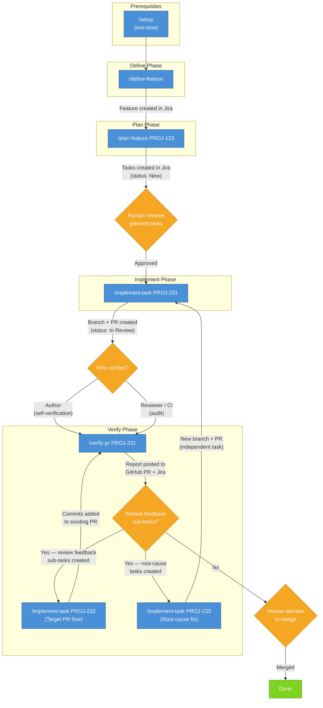
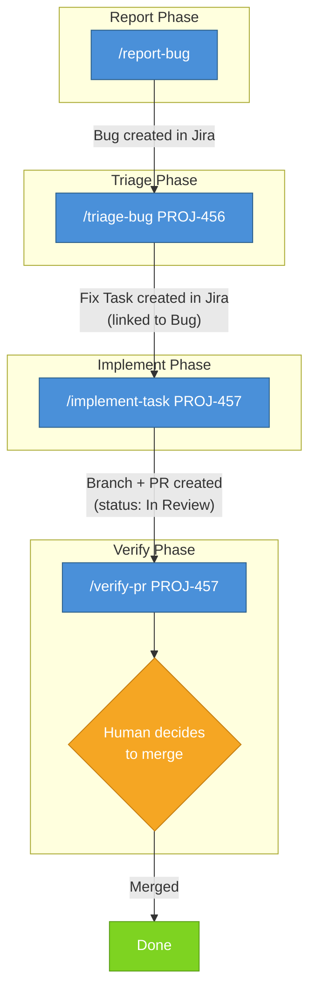
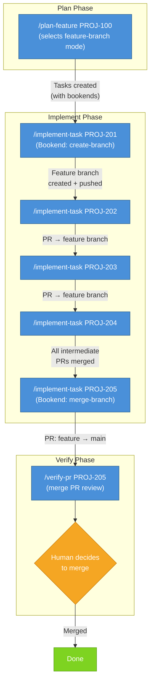

# SDLC Workflow

This document describes the execution workflow for the sdlc-workflow plugin skills.

## Workflow Overview



**Jira state transitions:** New → In Progress (implement-task) → In Review (implement-task) → Done (human merge)

---

## Prerequisite: Setup

**Skill:** `/sdlc-workflow:setup`

Configures a project's CLAUDE.md with the required `# Project Configuration` section. This is a one-time prerequisite for all other skills — plan-feature, implement-task, and verify-pr all validate Project Configuration before executing and will stop if it is missing.

**Invocation:**

```
/sdlc-workflow:setup
```

The setup skill is idempotent — running it multiple times on an already-configured project produces no changes. See [docs/project-config-contract.md](project-config-contract.md) for the required configuration structure.

---

## Execution Phases

The workflow follows four phases: **Define**, **Plan**, **Implement**, and **Verify**.

### Define Phase

**Skill:** `/sdlc-workflow:define-feature`

Interactively walks the user through all Feature description template sections and creates a fully-described Feature issue in Jira.

**Invocation:**

```
/sdlc-workflow:define-feature
/sdlc-workflow:define-feature My Feature Title
```

**Workflow:**
1. Validate Project Configuration in CLAUDE.md
2. Present a roadmap of the 9 template sections
3. Collect Feature summary (title)
4. Walk through each section interactively (with skip support)
5. Offer self-assignment
6. Preview the full description and collect approval
7. Create the Feature issue in Jira (labeled `ai-generated-jira`)
8. Post a summary comment and suggest `/plan-feature` as the next step

**Output:**
- Feature issue created in Jira with a structured description
- Summary comment on the created issue

**Guardrails:**
- Jira-only — no filesystem modifications permitted
- All description content must come from user input — no fabrication
- Issue is never created without user preview and approval

---

### Plan Phase

**Skill:** `/sdlc-workflow:plan-feature`

Converts a Jira feature into structured implementation tasks.

**Inputs:**
- Jira feature issue ID (required)
- Figma design URL (optional)

**Invocation:**

```
/sdlc-workflow:plan-feature PROJ-123
/sdlc-workflow:plan-feature PROJ-123 https://www.figma.com/design/abc123/MyDesign
```

**Workflow:**
1. Validate Project Configuration in CLAUDE.md
2. Fetch feature from Jira
3. Retrieve Figma mockups (if available)
4. Analyze repositories using Serena or fallback tools
5. Build a Repository Impact Map
6. Generate structured Jira tasks with dependencies

**Workflow mode determination:** After the Repository Impact Map is approved, the skill determines whether the feature requires **feature-branch mode** (all-or-nothing delivery) or **direct-to-main mode** (incremental delivery). The decision is based on atomicity indicators — coordinated schema migrations, breaking API changes, cross-cutting refactors, or tightly coupled feature components. When any indicator is present, feature-branch mode is selected; otherwise direct-to-main mode is used. The decision is recorded as a comment on the feature issue.

**Output:**
- Implementation tasks created in Jira (labeled `ai-generated-jira`)
- Impact map comment on the feature issue
- Workflow mode decision comment on the feature issue
- Issue links (feature incorporates tasks, task dependency chains)
- For feature-branch mode: `workflow:feature-branch` label on the feature issue

**Guardrails:**
- Planning-only — no file modifications permitted
- All output goes to Jira, never to the filesystem

---

### Implement Phase

**Skill:** `/sdlc-workflow:implement-task`

Takes a structured Jira task and implements it: modifies code, runs tests, commits, opens a PR, and updates Jira.

**Invocation:**

```
/sdlc-workflow:implement-task PROJ-231
```

**Workflow:**
1. Validate Project Configuration in CLAUDE.md
2. Fetch and parse the Jira task description
3. Verify dependencies are Done
4. Transition task to In Progress and assign to current user
5. Inspect code using Serena or fallback tools
6. Create feature branch (named after the Jira issue ID)
7. Implement changes scoped to the task
8. Write and run tests
9. Verify acceptance criteria
10. Self-verify scope containment and sensitive patterns
11. Commit (Conventional Commits, Jira ID in footer, assisted-by trailer)
12. Push branch and open PR
13. Update Jira (PR link, comment, transition to In Review)

**Guardrails:**
- Changes scoped to files listed in the task — no unrelated refactoring
- Code must be inspected before modification
- Incomplete descriptions require user clarification, not improvisation

---

### Verify Phase

**Skill:** `/sdlc-workflow:verify-pr`

Verifies a pull request against its originating Jira task's acceptance criteria and deterministic guardrails. The skill operates on local code for acceptance criteria verification, so it conditionally checks out the PR branch before inspecting files.

**Use cases:**

- **Author self-verification** — the contributor who ran `/implement-task` already has the PR branch checked out locally. The skill detects this and proceeds without a checkout.
- **Reviewer/CI audit** — another person or a headless CI job runs `/verify-pr` from an arbitrary branch. The skill detects the branch mismatch and checks out the PR branch automatically.

**Inputs:**
- Jira task issue ID with an associated PR (required)

**Invocation:**

```
/sdlc-workflow:verify-pr PROJ-231
```

**Workflow:**
1. Validate Project Configuration in CLAUDE.md
2. Fetch and parse the Jira task description
3. Identify the PR from the Jira custom field
4. Checkout the PR branch if not already on it
5. Review feedback resolution — read PR reviews, create sub-tasks for code change requests
6. Root-cause investigation — trace defects through the full workflow chain
7. Scope containment — compare changed files against the task
8. Diff size check
9. Commit traceability — verify Jira ID in commit messages
10. Sensitive pattern scan
11. CI status check
12. Acceptance criteria verification using local code inspection
13. Verification commands (if specified in the task)
14. Generate and post verification report to GitHub PR and Jira

**Output:**
- Verification report posted to both GitHub PR (as a PR comment) and Jira (as an issue comment)
- Review feedback sub-tasks created in Jira (with "Blocks" links and `review-feedback` label)
- Root-cause improvement tasks created in Jira (with `root-cause` label)
- No merge action taken
- No Jira status transition

**Guardrails:**
- Verification-only — does not modify code, merge the PR, or transition the Jira issue
- Criteria come from the Jira task description, not from reading the diff
- Report is informational — a human reviewer decides whether to merge
- Sub-tasks and root-cause tasks are informational — they track required fixes and systemic improvements but do not block verification

> **Design intent:** This workflow builds the foundation for safe auto-merge. Jira
> becomes the source of truth via blocking sub-tasks: once proven reliable, a future
> enhancement adds a merge decision step where verify-pr checks that all blocking
> sub-tasks are Done + all verification checks PASS + CI passes, then auto-merges.
> Auto-merge itself is out of scope for now — but every design decision aligns with
> this end state.

---

### Triage Phase (Security)

**Skill:** `/sdlc-workflow:triage-security`

Triages a Jira Vulnerability issue (CVE-based, auto-created by PSIRT) with full version awareness. Determines which supported product versions ship the vulnerable dependency, corrects Affects Versions, and either closes the issue or creates remediation Tasks.

**Invocation:**

```
/sdlc-workflow:triage-security PROJ-123
```

**Workflow:**
1. Validate Project Configuration and Security Configuration in CLAUDE.md
2. Extract CVE data from the Vulnerability issue
3. Analyze version impact across all supported versions using lock files at pinned source commits
4. Detect and check the development stream (unreleased Jira versions) at branch HEAD
5. Correct PSIRT-assigned Affects Versions against lock file evidence
6. Check for duplicates, EOL versions, and already-fixed cases
7. Post cross-stream impact comments when version impact differs across streams
8. Create remediation Tasks consumable by `/implement-task` — for source dependency
   ecosystems (Cargo, npm, Go modules), creates an upstream backport task and a
   downstream propagation subtask (blocked by the upstream task); for system package
   ecosystems (RPM), creates a single task

**Output:**
- Corrected Affects Versions on the Vulnerability issue
- Version impact table documenting per-version analysis
- Cross-stream impact comments (when streams differ)
- Upstream backport + downstream propagation Tasks for source dependency CVEs
- Single remediation Task for system package CVEs
- Audit trail comments on all affected issues

**Guardrails:**
- Jira-only output — no source file modifications
- Read-only source access via `git show` for lock files only
- Every Jira mutation requires explicit engineer confirmation
- No fabricated data — all evidence from actual lock file output or Jira API responses

---

### Bug Lifecycle

The bug lifecycle uses two entry-point skills (`report-bug` and `triage-bug`) that
feed into the existing `implement-task` and `verify-pr` phases.



**Jira state transitions:** New → In Progress (implement-task) → In Review (implement-task) → Done (human merge)

#### Report Phase

**Skill:** `/sdlc-workflow:report-bug`

Interactively walks the user through the project's bug description template sections
and creates a fully-described Bug issue in Jira. Also accepts structured input
programmatically from other skills.

**Invocation:**

```
/sdlc-workflow:report-bug
/sdlc-workflow:report-bug My Bug Summary
/sdlc-workflow:report-bug <structured-input>
```

**Workflow:**
1. Validate Project Configuration and Bug Configuration in CLAUDE.md
2. Load the bug description template
3. Walk through required sections interactively (or accept structured input)
4. Walk through optional sections
5. Offer self-assignment
6. Preview the full description and collect approval
7. Create the Bug issue in Jira (labeled `ai-generated-jira`)
8. Post a summary comment and suggest `/triage-bug` as the next step

**Output:**
- Bug issue created in Jira with a structured description
- Summary comment on the created issue

**Guardrails:**
- Jira-only — no filesystem modifications permitted
- All description content must come from user input — no fabrication
- Issue is never created without user preview and approval

#### Triage Phase (Bug)

**Skill:** `/sdlc-workflow:triage-bug`

Investigates a Jira Bug issue's root cause through codebase analysis and produces
a single linked Task that `/implement-task` can consume. The generated Task
front-loads a reproducer test as the first acceptance criterion.

**Invocation:**

```
/sdlc-workflow:triage-bug PROJ-456
```

**Workflow:**
1. Validate Project Configuration and Bug Configuration in CLAUDE.md
2. Fetch and parse the Bug issue description
3. Reproduce or trace the bug behavior
4. Investigate the codebase using Serena or fallback tools
5. Post root cause analysis comment on the Bug issue
6. Generate a fix Task with reproducer test front-loaded
7. Link Task to Bug (Task blocks Bug)
8. Flag multi-root-cause bugs for decomposition

**Output:**
- Root cause analysis comment on the Bug issue
- Fix Task created in Jira (labeled `ai-generated-jira`, linked to Bug)
- Description digest comment on the created Task

**Guardrails:**
- Read-only + Jira — no source code modifications permitted
- Only read-only tools for codebase investigation
- All output goes to Jira, never to the filesystem
- Multi-root-cause bugs flagged for decomposition rather than silently bundled

---

## Feature Branch Workflow Variant

When `plan-feature` selects **feature-branch mode**, the workflow wraps the normal implementation tasks with two bookend tasks that manage the feature branch lifecycle:



**Key differences from the direct-to-main workflow:**

- **Create-branch bookend** — creates and pushes the feature branch (named after the feature issue ID, e.g., `TC-4418`). Transitions directly to Done (no PR).
- **Intermediate tasks** — each implementation task targets the feature branch instead of `main`. PRs use `--base <feature-branch>`.
- **Merge-branch bookend** — creates a PR from the feature branch to `main`, aggregating all intermediate changes. Transitions to In Review.
- **Task dependencies** — all intermediate tasks depend on the create-branch task; the merge-branch task depends on all intermediate tasks.

**Jira state transitions:** New → In Progress → Done (create-branch bookend) | New → In Progress → In Review (intermediate + merge-branch tasks) → Done (human merge)

---

## Jira Task Structure

Tasks generated by `plan-feature` follow a structured template with these sections:

| Section | Required | Description |
|---|---|---|
| Repository | Yes | Single repository per task |
| Target Branch | Yes | Branch to use as the PR base (e.g., `main` or feature issue ID) |
| Description | Yes | What the task achieves and why |
| Files to Modify | No | Existing files to change, with reasons |
| Files to Create | No | New files to add, with purpose |
| API Changes | No | Endpoints to create or modify |
| Implementation Notes | No | Patterns to follow, code references |
| Acceptance Criteria | Yes | Pass/fail checklist |
| Test Requirements | Yes | Tests to write or update |
| Verification Commands | No | Commands to verify acceptance criteria |
| Target PR | No | Existing PR URL for review feedback fixes |
| Review Context | No | Original review comment that triggered the task |
| Bookend Type | No | `create-branch` or `merge-branch` for feature-branch bookend tasks |
| Dependencies | No | Prerequisite tasks |

Sections that do not apply are omitted (not left empty). File paths and implementation notes reference real code discovered during repository analysis.
