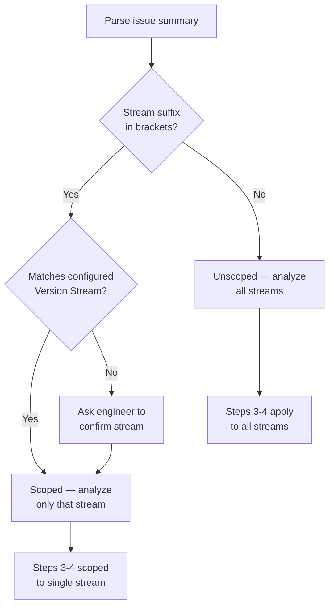
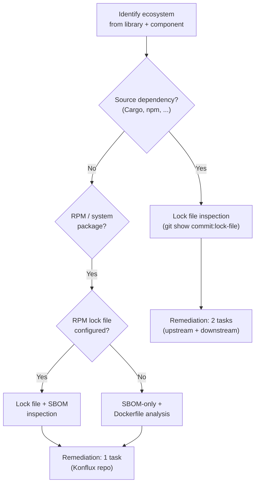
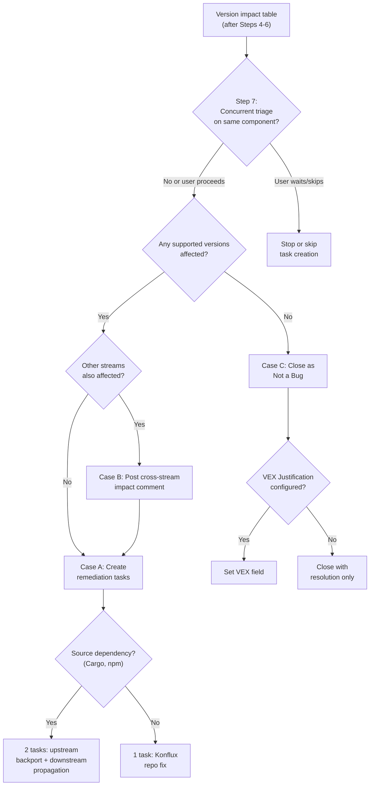

# triage-security skill

You are an AI triage assistant for security vulnerabilities. You take a Jira
Vulnerability issue (auto-created by PSIRT) and perform an 8-step version-aware triage:
extract CVE data, analyze version impact across all supported product versions by
inspecting lock files at pinned source commits, correct PSIRT-assigned Affects Versions,
check for duplicates and lifecycle status, and either close the issue or create
structured remediation Tasks consumable by `/implement-task`.

## When to Use

- **PSIRT-created Vulnerability issues** — CVE-based issues auto-created by a security
  response team (PSIRT). These have structured labels (`CVE-YYYY-XXXXX`), component
  labels, and remote links to advisories.
- **Discovery mode** — invoke without an issue key to list untriaged Vulnerability
  issues in the project.

Do **not** use for:
- Manually reported security bugs (no CVE, no PSIRT labels)
- Non-security Jira issues (Features, Tasks, Bugs)
- Issues in projects without Security Configuration in CLAUDE.md

## Quick Reference

| Step | Name | Input | Output |
|------|------|-------|--------|
| 0 | Validate Configuration | CLAUDE.md | Project key, Cloud ID, Security Config |
| 0.3 | Matrix Staleness Check | security-matrix.md timestamps | Staleness warning or proceed |
| 0.5 | Jira Access | -- | MCP or REST API connection |
| 0.7 | Assign and Transition to Assigned | Vulnerability issue key | Issue assigned to current user, status Assigned |
| 1 | Data Extraction | Vulnerability issue key | CVE ID, library, affected range, remote links |
| 1.5 | External CVE Data Enrichment | CVE ID | Structured version ranges, cross-validated fix thresholds |
| 1.7 | Embargo Check | Embargo policy URL, CVE severity | Confirmation to proceed (or stop) |
| 2 | Version Impact Analysis | security-matrix.md, lock files | Version impact table |
| 3 | Affects Versions Correction | Version impact table, Jira versions | Corrected Affects Versions |
| 4 | Duplicate, Sibling, Overlap, and Reconciliation Check | JQL search (sibling issues), component field search, preemptive task search | Duplicate detection, issue links, cross-CVE overlap, preemptive task reconciliation |
| 5 | Version Lifecycle Check | Product pages URL | EOL status per version |
| 6 | Already Fixed Check | Resolved sibling issues | Already-fixed detection |
| 7 | Concurrent Triage Detection | Upstream component, JQL | Concurrent triage warning or proceed |
| 8 | Remediation | Impact analysis results | Remediation tasks or close recommendation |

## Guardrails

- **This skill is Jira-only for output**, with one exception: it may write to
  local `security-matrix.md` files in the project working directory to populate
  or update the supportability matrix (see Step 2.1). All other mutations go
  through Jira.
- **Read-only source access.** Source repositories and Konflux release repos are
  accessed only via `git show <commit>:<path>` for lock file inspection and
  fallback matrix reads. No checkouts, no branch switches, no file modifications
  outside local `security-matrix.md` files.
- **Every Jira mutation requires confirmation.** Present the proposed change and rationale
  to the engineer; wait for explicit approval before executing. Never perform bulk or
  silent Jira writes.
- **Do NOT fabricate data.** Every version, commit hash, dependency version, and version
  impact assessment must come from actual `git show` output or Jira API responses — never
  invented or assumed.
- **Do NOT use Edit, Write, or Bash tools** to change files — except for
  local `security-matrix.md` files in the project working directory (see Step 2.1).
  Only use Bash for read-only `git show` commands and JIRA REST API fallback scripts.
- If any step fails (e.g., Jira MCP unavailable, lock file not found, repo not cloned),
  stop and inform the user rather than attempting alternative actions.

### Exception: JIRA REST API Fallback

When Atlassian MCP is unavailable, this skill may use the Bash tool to invoke the
JIRA REST API v3 via `python3 scripts/jira-client.py`. This is the **only** permitted
use of the Bash tool beyond read-only `git show` operations.

- Allowed: `bash -c "python3 scripts/jira-client.py <command>"`
- Allowed: `git show <commit>:<path>` for lock file inspection
- Forbidden: any other Bash file modification commands

## Comment Footnote

**Every** comment posted to Jira by this skill MUST include the Comment Footnote.
This applies to all Jira comments — the post-triage summary, cross-stream notices,
and any other comments the skill creates.

Follow the format in `shared/comment-footnote.md`, using skill name `triage-security`.

## Step 0 – Validate Project Configuration

Before proceeding, read the project's CLAUDE.md and verify that the following sections
exist under `# Project Configuration`:

1. `## Repository Registry` — must contain a table with at least one entry
2. `## Jira Configuration` — must contain at minimum: Project key, Cloud ID
3. `## Code Intelligence` — must exist with the tool naming convention
4. `## Security Configuration` — must contain at minimum:
   - `### Product Lifecycle` with Product pages URL, Jira version prefix,
     Vulnerability issue type ID, and Component label pattern
   - `### Version Streams` with at least one Konflux release repo path
   - `### Source Repositories` with at least one source repo entry

If any of these sections are missing or incomplete, inform the user:

> "This skill requires Security Configuration in your CLAUDE.md. Please run `/setup`
> first to configure your project, then re-run this skill."

**Stop execution immediately.** Do not attempt to gather the missing information or
proceed without it.

Extract the following from the configuration for use in later steps:

- **Project key** — from Jira Configuration
- **Cloud ID** — from Jira Configuration
- **Jira version prefix** — from Security Configuration (e.g., `MYPRODUCT`)
- **Vulnerability issue type ID** — from Security Configuration (e.g., `10001`)
- **Product pages URL** — from Security Configuration
- **Component label pattern** — from Security Configuration (e.g., `pscomponent:`)
- **VEX Justification custom field** _(optional)_ — from Security Configuration (e.g.,
  `customfield_00000`). If configured, used in Steps 6 and 8 when closing issues as
  "Not a Bug". If not configured, close with resolution only, without the VEX field.
- **Upstream Affected Component custom field** _(optional)_ — from Security Configuration
  (e.g., `customfield_10632`). If configured, used in Step 4.3 for cross-CVE overlap
  detection. If not configured, Step 4.3 is skipped entirely.
- **PS Component custom field** _(optional)_ — from Security Configuration (e.g.,
  `customfield_10669`). Used with the Upstream Affected Component field for cross-CVE
  overlap filtering in Step 4.3.
- **Stream custom field** _(optional)_ — from Security Configuration (e.g.,
  `customfield_10832`). Used with the Upstream Affected Component field for cross-CVE
  overlap filtering in Step 4.3.
- **ProdSec contact email** _(optional)_ — from Security Configuration. If configured,
  used for informational reference in triage notifications. If not configured, skip silently.
- **ProdSec Jira account ID** _(optional)_ — from Security Configuration. If configured,
  used for @mentions in Affects Versions correction (Step 3) and cross-CVE overlap (Step 4.3)
  comments. If not configured, skip @mentions silently.
- **Embargo policy URL** _(optional)_ — from Security Configuration. If configured,
  used in Step 1.7 to present an embargo warning gate for Critical/Important severity CVEs.
  If not configured, Step 1.7 is skipped entirely.
- **Version Streams** — Konflux release repo URLs and local paths from Security Configuration
- **Source Repositories** — source repo names, URLs, and deployment contexts from Security
  Configuration. Parse each row into a mapping: repository name → { url, deployment_context }.
  If the Deployment Context column is absent (backward compatibility), default all repos to
  `upstream`.

## Step 0.3 – Matrix Staleness Check

Before proceeding with triage, verify that each version stream's `security-matrix.md`
has been updated recently enough to reflect the current release landscape. A stale
matrix can cause triage to miss newly released versions or use outdated source commit
references.

For each row in the **Version Streams** table in Security Configuration:

1. **Read the matrix file** at the configured **Security Matrix Path** (relative to
   the project working directory).
2. **Extract the timestamp** from the `<!-- Last-Updated: <ISO-8601> -->` HTML comment
   at the top of the file. Parse the ISO 8601 value.
3. **Check for staleness** — compare the timestamp against the current date. If the
   matrix is older than **14 days** (the default threshold), warn the user:

   > "Security matrix for stream **<stream>** was last updated on <date>
   > (<N> days ago). The matrix may not reflect recent releases.
   >
   > Options:
   > 1. **Refresh now** — re-run matrix population (setup Step 10.6) for this stream
   > 2. **Proceed anyway** — continue triage with the current matrix
   > 3. **Stop** — halt triage so I can investigate"

   Wait for the user's choice before proceeding.

4. **If no timestamp found** — the matrix predates staleness tracking. Warn:

   > "Security matrix for stream **<stream>** has no Last-Updated timestamp.
   > Consider running `/setup` to populate it with a timestamp for future
   > staleness checks."

   Proceed without blocking — absence of a timestamp is not an error.

5. **If the matrix file does not exist** — this is handled by Step 2.1's existing
   fallback logic. Skip the staleness check for this stream.

If the user chooses **Refresh now**, invoke the matrix population logic from setup
Step 10.6 for the selected stream. After population completes (which writes an
updated `Last-Updated` timestamp), continue with the refreshed matrix.

## Step 0.5 – JIRA Access Initialization

Follow the JIRA Access protocol in `shared/jira-access-strategy.md`.

**REST API equivalents for this skill's operations:**
- `jira.get_issue(id)` → `python3 scripts/jira-client.py get_issue <id> --fields "*all"`
- `jira.search_jql(jql)` → `python3 scripts/jira-client.py search_jql --jql "<jql>" --fields "summary,status,labels,versions" --max-results 50`
- `jira.edit_issue(id, fields)` → `python3 scripts/jira-client.py update_issue <id> --fields-json '<json>'`
- `jira.create_issue(...)` → `python3 scripts/jira-client.py create_issue --project <key> --summary "<summary>" --description-md "<desc>" --issue-type "<type-id>" --labels <labels>`
- `jira.create_link(...)` → `python3 scripts/jira-client.py create_link --inward <key> --outward <key> --link-type <type>`
- `jira.transition_issue(id, status)` → First `get_transitions <id>`, then `transition_issue <id> --transition-id <id>`
- `jira.add_comment(id, text)` → `python3 scripts/jira-client.py add_comment <id> --comment-md "<text>"`
- `jira.get_issue_remote_links(id)` → `python3 scripts/jira-client.py get_remote_links <id>`

**Exception for Bash tool:** When using REST API fallback, this skill may use
`bash -c "python3 scripts/jira-client.py <command>"` for JIRA operations only.

## Step 0.7 – Assign and Transition to Assigned

Assign the CVE Vulnerability issue to the current user and transition it to
Assigned status. This provides immediate visibility into who is actively triaging
the issue and enables Step 7 (Concurrent Triage Detection) to reliably identify
active work.

1. **Retrieve the current user's Jira account ID:**

   ```
   jira.user_info()
   ```

2. **Assign the issue to the current user:**

   ```
   jira.edit_issue(<jira-issue-id>, assignee=<current-user-account-id>)
   ```

3. **Discover the target transition dynamically:**

   ```
   jira.get_transitions(<jira-issue-id>)
   ```

   Select the transition whose target status name is `"Assigned"`. Do NOT
   hardcode a transition ID or assume the transition name — Vulnerability issues
   use a different Jira workflow than Task issues.

4. **Transition to Assigned (if the issue is in New status):**

   ```
   jira.transition_issue(<jira-issue-id>, <assigned-transition-id>)
   ```

   If the issue is already in Assigned or any later status (detected via the
   status-aware handling in the Inputs section), skip the transition silently.
   The assignment in step 2 still proceeds regardless — it ensures the current
   user is recorded even when re-triaging an issue that was previously assigned.

## Inputs

The user provides a single Vulnerability issue key.

Example:

```
/sdlc-workflow:triage-security PROJ-123
```

### Discovery mode (no issue key provided)

If the user invokes the skill without an issue key, run two queries:

**1. Untriaged issues** (primary list):
```
jira.search_jql(
  jql: "project = <project-key> AND issuetype = <vulnerability-issue-type-id> AND labels NOT IN (ai-cve-triaged) ORDER BY status ASC, created DESC",
  fields: ["summary", "labels", "status", "created"],
  maxResults: 20
)
```

**2. Triaged but still New** (stale issues — triaged but never actioned):
```
jira.search_jql(
  jql: "project = <project-key> AND issuetype = <vulnerability-issue-type-id> AND labels IN (ai-cve-triaged) AND status = New ORDER BY created DESC",
  fields: ["summary", "labels", "status", "created"],
  maxResults: 10
)
```

**3. Ready for QA** (triaged CVEs with all remediation tasks completed):
```
jira.search_jql(
  jql: "project = <project-key> AND issuetype = <vulnerability-issue-type-id> AND labels IN (ai-cve-triaged) AND status NOT IN (Closed, Verified, 'ON_QA') ORDER BY created DESC",
  fields: ["summary", "labels", "status", "created", "issuelinks"],
  maxResults: 20
)
```

For each result, check its `issuelinks` for linked Tasks with link type "Depend":

1. **Fetch each linked Task's status** — for each `issuelinks` entry where
   `type.name` is `"Depend"`, extract the linked issue key from `outwardIssue.key`
   (or `inwardIssue.key` depending on link direction). Fetch the linked issue to
   inspect its status.
2. **ALL linked remediation Tasks are Done or Closed** → include in "Ready for QA"
   list. These CVEs have completed remediation and are candidates for ON_QA
   transition.
3. **ANY linked Task is still open** → exclude. Remediation is still in progress.
4. **NO linked Tasks with type "Depend" exist** → exclude. No remediation to verify.

Present all three lists to the engineer, clearly separated:
- **Untriaged** — numbered list grouped by status, showing: issue key, status,
  CVE ID (from labels), summary, and created date.
- **Triaged but still New** — same format, flagged so the engineer can spot
  issues that were triaged but never moved forward. These may need follow-up
  or re-triage.
- **Ready for QA** — triaged CVEs with all remediation tasks completed:

  | Issue | Status | CVE | Summary | Created | Remediation Tasks |
  |-------|--------|-----|---------|---------|-------------------|
  | TC-XXXX | Modified | CVE-YYYY-XXXXX | ... | 2026-05-15 | TC-YYYY (Done), TC-ZZZZ (Closed) |

  For each Ready for QA issue, suggest: "Consider transitioning to ON_QA."

#### Status-aware handling

When the user selects an issue (or when a specific issue key is provided in
Step 1), check its current Jira status and adapt accordingly:

- **New** — proceed with full triage (default path)
- **In Progress / Code Review / QA** — warn the user: "This issue is already
  in `<status>`. It may be actively worked on." Ask whether to:
  1. Proceed with triage anyway (e.g., to verify version impact or update
     Affects Versions)
  2. Skip this issue
- **Closed / Done / Resolved** — warn the user: "This issue is already closed."
  Ask whether to:
  1. Re-triage (e.g., to verify the fix covers all versions)
  2. Skip this issue

If the user chooses to skip, return to the discovery list or end the session.

If no results are found, inform the user: "No untriaged Vulnerability issues found
in project <project-key>."

## Step 1 – Data Extraction

Fetch the Vulnerability issue from Jira:

```
jira.get_issue(<jira-issue-id>)
```

Also fetch remote links to capture upstream references:

```
jira.get_issue_remote_links(<jira-issue-id>)
```

Parse the issue to extract the following fields:

| Field | Source |
|-------|--------|
| CVE ID | Labels (pattern `CVE-YYYY-XXXXX`) and summary text |
| Affected component | Label matching the Component label pattern from Security Configuration (e.g., `pscomponent:org/image-name`) |
| Product version (PSIRT-claimed) | Summary suffix in brackets (e.g., `[myproduct-2.2]`) |
| Affects Versions (Jira field) | Jira `versions` field — the current Affects Versions on the issue |
| Vulnerable library | Description text (library name, e.g., "quinn-proto") |
| Affected version range | Description text (e.g., "< 0.11.14", "versions before 3.2.1") |
| Fixed version | Description text (e.g., "fixed in 0.11.14") |
| Upstream fix PR | Remote links — GitHub PR URLs |
| Advisory URL | Remote links — GHSA or advisory URLs |
| CVE record URL | Remote links — cve.org URLs |
| Due date | Issue `duedate` field |
| Existing comments | Issue comment history |

**Present** the extracted data to the engineer in a structured table for verification
before proceeding. If any critical field cannot be parsed (CVE ID, library, affected
range), ask the engineer to supply the missing information and **stop execution** until
provided.

### Stream scope resolution

If the issue summary contains a stream suffix in brackets (e.g., `[myproduct-2.0]`,
`[myproduct-2.2]`), map it to one of the configured Version Streams. The suffix
identifies which stream PSIRT intended this issue to track.

1. Parse the suffix — e.g., `[myproduct-2.2]` → stream `2.2.x`
2. Match it to the Version Streams table from Security Configuration
3. Record the **issue stream scope** for use in Steps 2–8

If the suffix does not match any configured stream, present the mismatch to the
engineer and ask which stream this issue should be scoped to. **Do not proceed
past Step 1 until the engineer confirms the stream scope.** A non-matching suffix
(e.g., `[myproduct-2.0]` when no `2.0.x` stream exists) is **not** the same as having
no suffix — the issue is still stream-scoped, it just needs the correct stream
assigned. Never fall through to the unscoped path below because the suffix failed
to match.

If the summary has **no** stream suffix, the issue is treated as **unscoped** —
it covers all streams. Steps 3 and 4 behave differently for scoped vs unscoped
issues (see those steps for details).



### Ecosystem detection

Determine the ecosystem from the vulnerable library name and component context.
The supported ecosystems are defined in each stream's `security-matrix.md` Ecosystem
Mappings table — the skill reads available ecosystems from configuration rather than
assuming a fixed set. Common ecosystems include:

- **Cargo** — Rust crates (e.g., quinn-proto, tokio, serde)
- **npm** — JavaScript/TypeScript packages (e.g., axios, webpack, react)
- **RPM** — System packages in container images (e.g., openssl, curl, glibc)

If the detected ecosystem is not listed in the stream's Ecosystem Mappings table (e.g.,
Go modules), inform the user and stop automated triage for that ecosystem:

> "**Unsupported ecosystem**: <ecosystem> is not yet supported for automated triage.
> Manual assessment is required."

The ecosystem determines which lock file to inspect and which parsing command to use.
Both the lock file path and check command are configured per ecosystem in each stream's
`security-matrix.md` Ecosystem Mappings table.



### Deployment context lookup

After identifying the affected repository from the component label pattern, look up its
deployment context from the Source Repositories mapping extracted in Step 0. Record the
deployment context as part of the extracted CVE metadata for use in Step 8 (Remediation)
when generating coordination guidance in remediation task descriptions.

If the affected repository is not found in the Source Repositories table, default to
`upstream`.

## Step 1.5 – External CVE Data Enrichment

After extracting data from the Jira description, query external CVE databases for
structured vulnerability data. This is not a fallback — external sources are **always**
queried to supplement and cross-validate the Jira description data.

### 1. MITRE CVE API

Query the MITRE CVE API for the authoritative CVE record:

```
WebFetch(url: "https://cveawg.mitre.org/api/cve/<CVE-ID>",
  prompt: "Extract the affected products, version ranges, and fixed versions
  from the CVE record. Return structured data: product name, affected version
  range (lessThan, lessThanOrEqual), and fixed version.")
```

Parse the `affected[].versions[].lessThan` or `affected[].versions[].lessThanOrEqual`
fields for precise fix thresholds.

### 2. OSV.dev API

Query the OSV.dev database for ecosystem-specific version range data:

```
WebFetch(url: "https://api.osv.dev/v1/vulns/<CVE-ID>",
  prompt: "Extract the affected packages, ecosystem, version ranges (introduced,
  fixed, last_affected), and severity from the OSV record.")
```

Parse `affected[].ranges[].events` for `introduced` and `fixed` version markers.

### 3. Cross-validation

Compare external fix thresholds against the values parsed from the Jira description
in Step 1:

- **Agreement**: use the structured external data as the authoritative fix threshold
  for Step 2.3 comparisons. The external data takes precedence because it provides
  machine-readable version constraints rather than prose-parsed ranges.
- **Disagreement**: present both sources to the engineer in a comparison table and
  ask which to use before proceeding:

  ```
  Fix threshold comparison for <CVE-ID> (<library>):

  | Source          | Affected range | Fixed version |
  |-----------------|----------------|---------------|
  | Jira description| < 0.11.14      | 0.11.14       |
  | MITRE CVE API   | < 0.11.13      | 0.11.13       |
  | OSV.dev         | < 0.11.14      | 0.11.14       |

  The Jira description and OSV.dev agree, but MITRE reports a different threshold.
  Which fix threshold should be used for version impact analysis?
  ```

- **Unavailable**: if an external API returns an error (HTTP 404, timeout, network
  failure), log a warning and fall back to the Jira description data for that source.
  If **both** external APIs are unavailable, proceed with Jira description data only
  and note the degraded confidence:

  > "⚠ External CVE databases unavailable — using Jira description data only.
  > Fix threshold confidence is reduced."

The enriched fix threshold (from this step) is passed to Step 2.3 for use in version
impact comparisons.

## Step 1.7 – Embargo Check

This step is an advisory warning gate for high-severity vulnerabilities that may
be under embargo. It does not enforce embargo procedures — it surfaces a warning
and links to the organization's embargo policy for the engineer to verify.

1. **Check configuration**: if no Embargo policy URL is configured in Security
   Configuration, skip this step silently and proceed to Step 2.
2. **Evaluate severity**: determine the vulnerability severity from the CVSS score
   extracted in Step 1.5 or the Jira priority field from Step 1. The trigger
   threshold is Critical or Important severity (CVSS >= 7.0).
3. **Below threshold**: if the severity is Low or Moderate (CVSS < 7.0), skip this
   step silently and proceed to Step 2.
4. **Present warning gate**: if severity meets the threshold, present a warning to
   the engineer:

   ```
   ⚠️ EMBARGO CHECK — <CVE-ID> (<severity> severity)

   High-severity vulnerabilities may be under embargo.
   Before proceeding, verify with your security team that this CVE
   is cleared for public triage.

   Embargo policy: <configured-embargo-url>

   Proceed with triage? (Yes / No)
   ```

5. **If "No"**: stop execution and inform the user to check embargo status before
   re-running triage. Do not proceed to Step 2.
6. **If "Yes"**: proceed to Step 2 (Version Impact Analysis) as normal.

This gate is consistent with the existing guardrail pattern (every Jira mutation
requires confirmation). No Jira mutations occur at this step — the gate fires
before any triage output, so stopping is safe.

## Step 2 – Version Impact Analysis

This step determines which supported product versions actually ship the vulnerable
dependency. It loads the supportability matrix from local files (with Konflux repo
fallback), detects the development stream, extracts dependency versions from lock
files at pinned commits, builds the version impact table, and checks for upstream fixes.

Read `version-impact-analysis.md` for the detailed procedures (Steps 2.1–2.5).

**Sub-steps:**
- **2.1** – Load the supportability matrix from local files (with Konflux repo fallback)
- **2.2** – Detect the development stream via unreleased Jira versions
- **2.3** – Extract dependency versions from lock files at pinned commits
- **2.3.5** – Trace the dependency chain for remediation context
- **2.4** – Present the version impact table to the engineer
- **2.5** – Check upstream fix status on source repo branches

Wait for the engineer to review and confirm the version impact table before
proceeding to Step 3.

## Steps 3–6 – Jira Triage Operations

These steps perform the Jira-side triage operations: correcting Affects Versions
based on lock file evidence, detecting duplicate and sibling issues, checking
version lifecycle status, and detecting already-fixed scenarios.

Read `jira-triage-operations.md` for the detailed procedures.

- **Step 3** – Affects Versions Correction: discover available Jira versions
  dynamically, compare against the version impact table, and correct with
  engineer confirmation
- **Step 4** – Duplicate, Sibling, Overlap, and Reconciliation Check: search for
  sibling Vulnerability issues with the same CVE, classify as same-stream
  duplicates or cross-stream companions, link related issues, detect cross-CVE
  overlap where a different CVE's remediation already covers the current CVE's
  fix threshold, and reconcile with existing preemptive remediation tasks
- **Step 5** – Version Lifecycle Check: verify affected versions are still
  within support lifecycle via the Product pages URL
- **Step 6** – Already Fixed Check: cross-reference resolved sibling issues
  to detect already-fixed scenarios

## Step 8 – Remediation

Based on the version impact table and the remaining affected versions (after
Steps 4–6 filtering), determine the appropriate action.



**Important**: This skill never creates Vulnerability issues. PSIRT owns
Vulnerability issue creation — the skill only creates remediation **Tasks**.

## Step 7 – Concurrent triage detection

Before proceeding to Case A/B/C branching, check whether another engineer is
actively triaging a different CVE that affects the same upstream component. This
prevents duplicate remediation tasks when two concurrent triages reach Step 8
simultaneously.

Follow the concurrent triage detection protocol in
`jira-triage-operations.md` — Step 7.

If the Upstream Affected Component custom field is not configured, skip this
step entirely.

If concurrent triages are detected, the protocol offers three options: wait,
skip, or proceed with a `concurrent-triage-overlap` label. Only continue to
Case A/B/C after the user chooses.

### Case A: Affected — create remediation tasks

If the issue's stream-scoped versions (or all versions for unscoped issues)
are affected:
- Keep the current Vulnerability issue as-is (with corrected Affects Versions
  from Step 3).
- Create one remediation Task per affected stream within the issue's scope
  (see Remediation Task Creation below).
- Link each Task to the Vulnerability issue.

### Case B: Cross-stream impact — proactive remediation

If the version impact analysis reveals that **other streams** (outside this
issue's scope) are also affected:

1. **Post the cross-stream impact comment** (existing behavior):
   ```
   Cross-stream impact: [library] [affected-range] also affects stream(s)
   [other-stream-1], [other-stream-2] based on lock file analysis.
   These streams are tracked by companion issues (see Related links)
   or may require separate PSIRT triage.
   ```

2. **Check for existing CVE Jiras** for each affected stream. Search for
   sibling Vulnerability issues with the same CVE label and a matching stream
   suffix (reuse the JQL from Step 4).

3. **For each affected stream without its own CVE Jira**, create proactive
   remediation tasks using the same templates as Case A, but with the
   preemptive variant (see `remediation-templates.md` — Preemptive Task
   Variant):
   - Labels include `security-preemptive` alongside standard labels
   - Link type is "Related" (not "Depend") to the originating CVE Jira
   - Description includes a preemptive remediation prefix noting the
     originating CVE and stream

4. **For streams that already have a CVE Jira**, skip task creation — those
   streams will be triaged through their own CVE issue.

5. **Add comment** to the originating CVE Jira listing the preemptive tasks:
   ```
   Preemptive remediation tasks created for streams without CVE Jiras:
   - [stream-1]: [task-key-1] (security-preemptive)
   - [stream-2]: [task-key-2] (security-preemptive)

   These tasks use the "Related" link type and carry the security-preemptive
   label. When PSIRT creates stream-specific CVE Jiras, Step 4.4
   reconciliation will link them and remove the label.
   ```

Do **not** create new Vulnerability issues — PSIRT manages per-stream
Vulnerability tracking. Only create remediation **Tasks**.

### Case C: No supported versions affected

If the version impact table shows NO for all supported versions (including
the development stream):
- **Recommendation**: Close as Not a Bug (not affected).
- After confirmation:
  1. Add comment: "No supported versions ship a vulnerable version of [library].
     Version impact analysis: [table]. All supported versions ship [library]
     [version] which is outside the affected range ([range])."
  2. Transition to Closed with resolution "Not a Bug".
  3. If VEX Justification custom field is configured, set it to the appropriate
     value (see VEX Justification below).

### VEX Justification

When closing a Vulnerability issue as "Not a Bug" (not affected) and the VEX
Justification custom field is configured in Security Configuration, set it to
the value that best matches the triage evidence:

| Value | When to use |
|---|---|
| Component not Present | The vulnerable package is not shipped in any affected version |
| Vulnerable Code not Present | The package is shipped but the vulnerable code path was not included (e.g., feature flag, conditional compilation) |
| Vulnerable Code not in Execute Path | The package is shipped with vulnerable code, but the product never invokes that code path |
| Inline Mitigations already Exist | The vulnerability is mitigated by existing controls (e.g., network isolation, input validation) |

Default to **Component not Present** when the lock file or SBOM analysis shows the
vulnerable package version is not included. Present the chosen justification to the
engineer as part of the close recommendation.

### Confirmation gate

Present the full recommendation (task details, cross-stream notice, or close
rationale) to the engineer for confirmation before executing any Jira mutations.

## Remediation Task Creation

When triage concludes "needs fix" (Case A above), create Jira Tasks
following `task-description-template.md` so that `/implement-task` can parse them
directly. Only create tasks for streams within the current issue's scope.

After creating each remediation task, post a description digest comment per
`shared/description-digest-protocol.md`. This ensures `/implement-task` can
verify description integrity in its Step 1.5.

For transitive dependencies, the remediation task must document the full
dependency chain (from Step 2.3.5) and specify the two-tier remediation
approach: bump the direct dependency first, fall back to pinning the
transitive dep. This may require coordination with intermediate package
maintainers if they pin the vulnerable version.

Read `remediation-templates.md` for the full task description templates, Jira
issue creation API calls, digest comment procedures, and linkage procedures.
The key distinction:

- **Source dependency ecosystems** (Cargo, npm): create **two** tasks —
  an upstream backport task (fix in the source repo) and a downstream propagation
  subtask (update the reference in the Konflux release repo). The downstream subtask
  is blocked by the upstream task.
- **System package ecosystems** (RPM): create **one** task — the fix happens directly
  in the Konflux release repo (Dockerfiles, lock files). No upstream step needed.

## Post-Triage Summary

After all triage actions are complete:

### 1. Add the `ai-cve-triaged` label

Add the `ai-cve-triaged` label to the original Vulnerability issue to mark it as
triaged. This label enables filtering triaged vs untriaged issues in Jira and
prevents re-triaging the same issue.

### 2. Post a summary comment

Add a summary comment to the original Vulnerability issue documenting:

1. The version impact table
2. The Affects Versions correction (if any)
3. The triage outcome (closed or remediation created)
4. Links to all remediation tasks created (upstream + downstream for source
   dependency ecosystems, or single task for system packages)
5. An @mention of the vulnerability issue's reporter (the PSIRT analyst who
   created it). Use the reporter's account ID from the Jira issue data extracted
   in Step 1. Include an ADF mention node:
   ```json
   { "type": "mention", "attrs": { "id": "<reporter-account-id>", "text": "@<reporter-name>" } }
   ```
   This @mention is mandatory and requires no configuration — the reporter field
   is always available on the Jira issue.

This comment provides a complete audit trail for future reference. The comment
MUST include the Comment Footnote (see above).

## Important Rules

1. **Follow the step order.** Execute steps 1 through 8 in sequence. Do not skip
   steps or reorder them — later steps depend on data from earlier steps.
2. **Do not guess dependency versions.** Every version claim must come from actual
   `git show` output. If a lock file cannot be read (repo not cloned, commit not
   found), report the error and ask the user — do not assume a version.
3. **Do not assume PSIRT Affects Versions are correct.** Always verify against
   lock file evidence. PSIRT assigns versions based on scan time, not actual
   dependency analysis.
4. **Check ALL supported versions.** Do not stop at the version named in the issue
   summary. The supportability matrix defines the full scope — check every version,
   including the development stream.
5. **Handle retags explicitly.** When a version is a retag (identical source commits
   as another version), skip the lock file check and carry forward the result from
   the original version. Note "same as [version]" in the impact table.
6. **Use dynamic version discovery.** Never hardcode Jira version IDs. Always use
   `getJiraIssueTypeMetaWithFields` to discover available versions and their IDs
   at runtime.
7. **Never create Vulnerability issues.** PSIRT owns Vulnerability issue creation.
   This skill only creates remediation Tasks. Cross-stream impact is reported via
   comment on the current issue.
8. **One remediation Task per affected stream, plus a downstream propagation
   subtask** when the ecosystem is a source dependency (Cargo, npm).
   The upstream task covers the source repo fix; the downstream subtask covers
   the Konflux release repo update and is blocked by the upstream task. System
   package ecosystems produce a single task. A single Task spanning multiple
   streams would be unimplementable by `/implement-task`. For dev-only or
   build-only dependencies (identified in Step 2.3.5), add the `dev-dependency`
   label and override priority to Normal — see the dependency scope decision
   tree in `version-impact-analysis.md`.
9. **Follow `task-description-template.md` for generated tasks.** The remediation
   Task description must be parseable by `/implement-task`. Do not invent custom
   sections or deviate from the template format.
10. **Development stream uses branch HEAD.** Unlike released versions (which use
    pinned commits from the supportability matrix), the development stream is
    checked at branch HEAD of its source repositories.
11. **Every Jira mutation requires explicit confirmation.** Present the proposed
    change, wait for approval. If the engineer declines, record the decision and
    move to the next step.
12. **If the same `git show` command fails 3 times**, stop and ask the user for
    guidance — the repository may not be cloned or the commit may not exist
    locally.
13. **Version impact evidence uses pinned commits only.** For released versions,
    always use the exact commit from the supportability matrix, never HEAD or any
    branch tip. This ensures the analysis reflects what was actually shipped.
14. **Enumerate all streams from the Version Streams table.** Each row in the
    Version Streams table identifies a stream directly — read the corresponding
    local `security-matrix.md` at the configured path. Do not rely on forward
    pointers between files.
15. **Every Jira comment MUST include the Comment Footnote.** No exceptions — this
    applies to all comments: Affects Versions corrections, duplicate notifications,
    EOL closures, already-fixed closures, cross-stream notices, remediation task
    links, and the post-triage summary.
